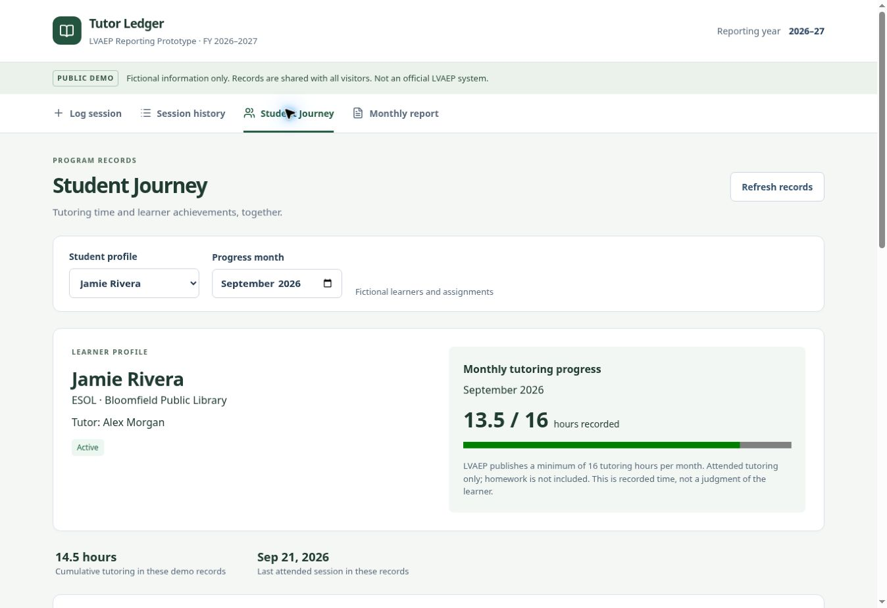

# Verification evidence — September 22, 2026

## Actual public production browser

Origin: https://tutor-ledger-kuljot.ks4573119468.chatgpt.site/

This supersedes the original preview-only QA. Browser interactions used the public origin, not terminal POST requests or the internal preview database.

### Before feature changes

Created Jamie Rivera / September 17 at 1.25 hours with a disposable QA note. Refreshed and verified persistence. Edited to 1.75 hours, refreshed and verified the edit. Replaced the native JavaScript delete confirmation with an in-page accessible dialog after it stalled the test browser. Deletion then succeeded and remained deleted after refresh. September report and downloaded CSV contained the original four records totaling 4.75 hours. No QA record remained.

### After Student Progress deployment (version 4)

- Public page loaded with prototype identity and fictional/shared-data notice.
- Loaded nine additional fictional examples; the five prior records remained. Repeated loading added zero records.
- Jamie's September profile showed 13.5/16 hours, 14.5 cumulative demo hours, last attended September 21, a family milestone and the zero-hour absence. August progress changed to 1/16 while the timeline retained all months.
- Jordan's stopped profile showed the fictional reason, Passaic site and retained sessions/achievement. Monthly reference was explicitly labeled historical context.
- Created a disposable Jamie / September 17 record at 1.25 hours with a Family achievement. Reloaded and found both duration and achievement in history.
- Edited to 1.75 hours with a different Family achievement and note. Reloaded; Student Progress showed the edited milestone and 15.25/16 hours.
- Tried a duplicate assignment/date; received the intended conflict message. No duplicate was created.
- Changed the disposable record to tutor absent: hours disabled and saved as zero; milestone remained, progress returned to 13.5/16.
- Tested Cancel in the delete dialog (record retained), then confirmed deletion. Reloaded and confirmed no September 17 QA record remained.
- September report: 13 daily records, 11 attended, two absences/holidays, 19.25 tutoring hours. Taylor filter: two attended records, 2.75 hours. August + Taylor showed the correct empty state.
- Exported September CSV through the browser. Parsed actual downloaded file: 13 rows, 19.25 hours, three structured achievements, program/site columns, no QA notes. The browser's download-event observer timed out, but the file downloaded successfully and was independently inspected.
- Desktop screenshot inspected: readable labels, working navigation, clear progress and structured timeline. The report opened through normal controls earlier and through the optional registered report-navigation tool during final filtering QA.

These are observed totals at test time, not promises about shared public data. Anyone may edit the demo.

## Automated verification

- TypeScript type checking passed.
- Production build passed.
- 12 domain tests passed: original validation/report/CSV checks plus learner/month isolation, all absence-type exclusion, last attended date, empty history, actual hours above 16, optional/invalid achievements and Other notes requirement.
- SQLite tests ran the actual migrations: existing rows survive the additive column, default empty achievement, persistence, duplicate and attendance constraints, updates/deletes, and conflict-do-nothing preserving existing edits.
- Source export inspected for accidental credentials and private data; build output, dependencies, databases and environment files excluded. Hosting project identity removed from the export, logical DB binding retained.

## Explicit limits

- **Mobile layouts were manually inspected on iPhone Safari after the final responsive pass.** Session History, Student Progress, and Monthly Report were reviewed at phone width. Automated mobile-device interaction testing was not performed.
- An early click immediately after reload happened before hydration and did not switch tabs; waiting for the loaded form then clicking worked. Avoid rapid clicking during the brief initial load.
- No simulated storage outage or multi-browser concurrent-edit test. Last-write-wins and permanent deletion remain documented limitations.
- Public CRUD is now browser-verified. The earlier terminal hosting-edge 403 is not treated as a production browser failure.
- Source is published in the public GitHub repository `kuljot-singh/tutor-ledger-lvaep`. Repository visibility and root project contents were verified after upload.

